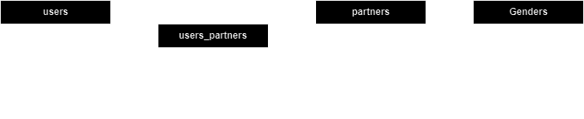

#  [VKinder](https://github.com/netology-code/adpy-team-diplom/blob/main/README.md)
## О программе    

Данная программа описывает логику работы чат-бота сообщества знакомств ВКонтакте. После вступления в сообщество, пользователь может начать диалог с ботом, и тот, на основании данных пользователя подберет и предложит ему партнера для потенциального знакомства: имя, фамилия, ссылка на страницу и фотографии профиля (не более 3-х).
___
После запуска диалога с ботом, пользователю становится доступен небольшой интерфейс по взаимодействию в виде кнопок.  
|Кнопка|Описание|
|:-:|:-|
| **Начать** | Кнопка инициализации, приветствия пользователя и его регистрации в базе данных |
| **Повторить ♻** | Кнопка отображается, если по результатам проверки, в профиле пользователя не указаны минимально необходимые данные: город, дата рождения и пол. Запускает повторную проверку информации профиля пользователя с последующим отображением кнопки **`Начать поиск 💕`** |
| **Начать поиск 💕** | Кнопка запуска процедуры поиска подходящих партнеров. По результатам выполнения данной команды пользователю отображаются потенциальные партнеры для знакомства |
| 👍 | **Встроенная в сообщение кнопка реакции пользователя на предлагаемого партнера (нравится)**. Добавляет партнера в базу данных с возможностью его последующего просмотра кнопкой **`Показать понравившихся 😍`** |
| 👎 | **Встроенная в сообщение кнопка реакции пользователя на предлагаемого партнера (не нравится)**. Добавляет партнера в базу данных с пометкой игнорировать - в дальнейшем помеченный партнер предлагаться пользователю никогда не будет |
| **Начать сначала 🔄** | **Основной интерфейс**. Кнопка аналогична **`Начать поиск 💕`** - обновляет список потенциальных партнеров, является частью основного интерфейса |
| **Далее 🔀** | **Основной интерфейс**. Кнопка перехода к следующему потенциальному партнеру |
| **Показать понравившихся 😍** | **Основной интерфейс**. Кнопка отображения всех понравившихся пользователю потенциальных партнеров (на которых пользователь отреагировал кнопкой `👍`) |

## Структура программы, модули и библиотеки
Скрипт бота состоит из следующих модулей и пакетов:

1. Основной модуль [**`main.py`**](main.py)

Содержит основную логику работы бота Vk-сообщества. Состоит из 3-х основных  классов: `Database` для  взаимодействия с базой данных (CRUD-запросы), `VkontakteAPI` для осуществления запросов к API ВКонтакте и `VkontakteBot` для обработки и отправки сообщений в чат пользователю.

2. Модуль [**`models.py`**](models.py)

Описывает модели таблиц базы данных, а также содержит функции облегчающие процесс подготовки базы данных к работе. Схема используемых сущностей приведена ниже.



3. Пакет [**`extrapacks`**](extrapacks)

Содержит вспомогательные модули [**`logging_functions.py`**](extrapacks/logging_functions.py), обеспечивающий логгирование программы и [**`config.py`**](extrapacks/config.py), содержащий константы для инициализации программы и 
ее подключения к боту Vk-сообщества и базе данных.

4. Пакет [**`tests`**](tests)

Содержит unit-тесты классов `Database`, `VkontakteAPI` основного модуля **`main.py`**. Для проведения тестирования не требуется создавать новую тестовую базу данных - тестовые данные могут быть добавлены в текущую с последующим их (автоматическим) удалением.

5. Сторонние библиотеки

В качестве сторонних библиотек, необходимых для взаимодействия программы с базой данных и ботом Vk-сообщества, используются [SQLAlchemy](https://pypi.org/project/SQLAlchemy/) и [vk_api ](https://pypi.org/project/vk-api/). Тестирование программы осуществлялось с помощью библиотеки [pytest](https://pypi.org/project/pytest/)

---
Используемые при написании и тестировании программы версии данных библиотек указаны в [requirements.txt](requirements.txt)

---

## Подготовка к работе 
1. Для подключения к боту Vk-сообщества, в модуль **`config.py`** необходимо ввести полученный токен сообщества. Также, в связи с отсутствием собственного сервера переадресации и следовательно возможности получить токен его ручной передачи боту (для совершения операций от его имени), запросы к API ВКонтакте осуществляются с собственным токеном пользователя (получить его можно по [ссылке](https://oauth.vk.com/authorize?client_id=*******&redirect_uri=https://example.com/callback&display=page&scope=photos,offline&response_type=token&v=5.131), заменив звездочки в client_id на ID приложения в URL)
   
   ```python
    VKGROUP_TOKEN = 'Токен сообщества'
    VKUSER_TOKEN = 'Токен пользователя'
   ```

2. Для подключения к базе данных, в модуль **`config.py`** необходимо ввести параметры подключения (при разработке программы использовалась локальная база данных PostgreSQL):
   
   ```python
    DB_DRIVER = 'postgresql' 
    DB_LOGIN = 'postgres'
    DB_PASSWORD = 'Пароль'
    DB_CONNECTION = 'localhost'
    DB_PORT = '5432'
    DB_NAME = 'Название базы данных'
   ```
3. Для создания таблиц в базе данных по описанным моделям и их заполнения данными, можно воспользоваться модулем **`models.py`**. Для этого необходимо раскомментировать код в конце модуля и запустить его, скрипт автоматически создаст таблицы и заполнит некоторые необходимыми данными из текстового файла **data\names.txt**:
   
   ```python
    if __name__ == '__main__':
        DatabaseConfig.create_table()
        DatabaseConfig.filling_out_gender()
   ```

## Запуск и работа с ботом Vk-сообщества

1. Запуск Telegram-бота осуществляется из модуля **`main.py`**, после чего в терминале отображается сообщение `Bot is running...`, свидетельствующее об осуществлении процедуры опроса серверов ВКонтакте на предмет наличия новых сообщений для бота. 
> В связи с тем, что скрипт сохраняет в базу и хранит в словаре `users_state` информацию о пользователе (необходим для сохранения текущего состояния пользователя - всех найденных для него потенциальных партнеров и текущего просматриваемого), первое взаимодействие с ботом со стороны нового пользователя должно начинаться с команды **`Начать`**.

2. Поскольку скрипт регулярно обращается к базе данных для различного рода запросов, при запуске модуля **`main.py`** открывается сессия подключения.
   
3. Для остановки скрипта бота Vk-сообщества используется команда **`Стоп`**, которую необходимо отправить в чат боту. В подтверждение остановки в терминале отобразится сообщение `Bot stopped from chat.`

4. В течении всего времени работы скрипта доступны [логи](progress.log) программы, фиксирующие запуск/остановку, получаемые из чата команды и результаты их выполнения.

